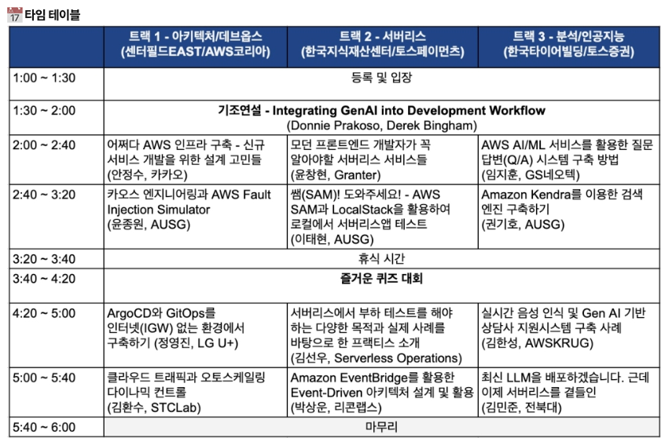
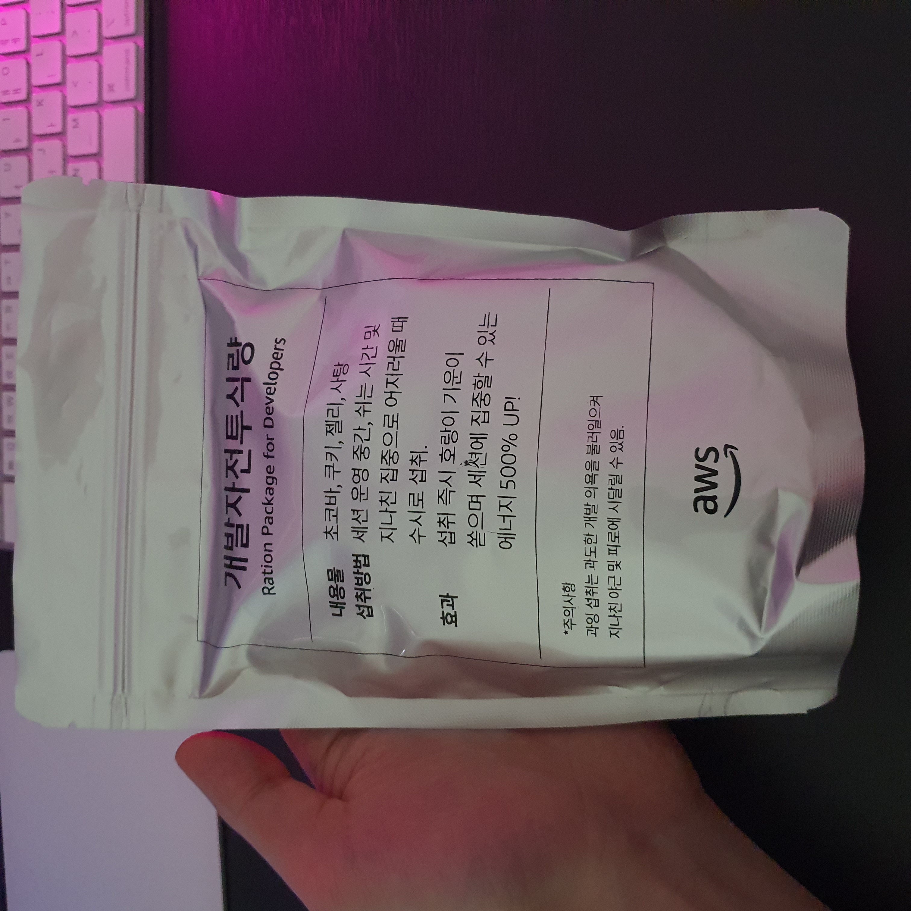

# 개요

## 트랙

저는 트랙 1 - 아키텍처/데브옵스에 참여하였습니다.

# Integrating GenAI into Development Workflow (Donnie Prakoso, Derek Bingham)

## 일반적인 소프트웨어 개발 주기

1. 코딩 및 리뷰
2. 빌드 및 테스트
3. 배포
4. 관찰
5. 개선

## Serverless 함수 및 컨테이너

### AWS Lambda

- 서버리스 함수
- 이벤트 중심
- 비지니스 로직을 성계한 작은 기능
- 단기 실행 및 주문형
- 트래픽 급증

### AWS Fargate

- 서버리스 컨테이너
- 유연하게 구동
- 더 큰 앱
- 장기간 실행 및 지속적으로 사용 가능
- 일관된 트래픽

### AWS Lambda 작동 원리

1. Event source
   - 데이터 상태 변화
   - 엔드포인트에 대한 요청
   - 리소스 상태 변경
2. Function
   - Node.js
   - Python
   - Java
   - ...
3. Services

### AWS Serverless Application Model (SAM) & AWS Cloud Development Kit (CDK)

AWS SAM
- SAM CLI
- 로컬에서 Lambda 개발
- YAML 정의
- 사용자 정의를 위해 CloudFormation으로 솩장
- CDK로 변환

AWS CDK
- 인프라를 완벽하게 제어
- AWS 등을 활용하는 사전 구축된 다양한 라이브러리를 위한 허브 구축

### Amazon Bedrock

Amazon Bedrock은 이미지, 텍스트 등 다양한 인공지능 모델을 제공합니다.

### Application Composer

AWS에 여러 서비스를 canvas에서 설계할 수 있습니다. 그리고 template까지 제공합니다.

---

# 어쩌다 AWS 인프라 구축 - 신규 서비스 개발을 위한 설계 고민들 (안정수, 카카오)

## 배경

기존에 프로젝트에 레거시에 지쳐 있었는데 마침 새로운 서비스를 맡을 수 있었다고 합니다. 신규 서비스를 할때 기술에 대한 자율이 주어져서 AWS를 적극적으로 활용하면서
서비스를 배포한 경험에 대해 알려주셨습니다.

## 무엇을 준비해야할까

1. 네트워크 기반 구성
2. 사용할 서비스 선택
3. 배포환경 구성
4. 모니터링

## VPC를 어떻게 설계할 것인가?

#### IPv4 CIDR block 이란?

IPv4 CIDR block 10.0.0.0/16 은 큰 대역으로 65535 개의 IP 사용 가능

- 미리 IP가 몇개나 필요할지 계산해보자
- 사내 Network 대역 연결 고려
- 다른 팀에서 운영하는 VPC 대역과 겹치지 않게
- Develop / Production 구분하여 설계
- EKS 쓴다면 X2 배 대역
- **너무 크지 않게 & 겹치지 않게**

## Subnet 구성을 어떻게 할 것인가?

- Nat (Public subnet)
- EKS Worker (Private subnet)
- Database (Private subnet)
- VPC Endpoint (Private subnet)

총 4개의 서브넷으로 구성하였습니다.

## AZ는 몇개로 해야할까?

- AZ를 많이 사용하면 비용 증가
- VPC 대역도 고려
- Aurora 다중 AZ를 필요로 한다면 3 AZ
- 2 or 3 AZ 중 선택

실제 2개 AZ 사용하였습니다.

## 어떤 AWS 서비스를 선택할 것인지?

AWS 에는 서비스가 무수히 많기 때문에 필요한 서비스를 고르는 것도 고민이 필요합니다.

## 필요한 서비스

- Computing - EKS
- Database - RDS for MySQL
- Storage - S3 / CloudFront
- Cache - Redis on ElasticCache
- Push Integration - SNS, SQS, Kinesis

### EKS

- 사내 Private Cloud에서 K8S 경험 있음
- AWS Managed 라서 더 편리하기를 기대
- 실제로는 가장 많은 시간이 소요됨

하지만 다시 한다면 선택하지 않을것입니다.

#### EKS 노드 그룹 선택하기

1. Managed - 인스턴스 타입, 사이즈만 결정하면 됨
2. AWS Fargate - pod에 정의된 리소스에 맞게 1 pod / 1 instance 알아서 맞춰줌
3. Self-managed - 이걸 쓰면 직접 kubelet, kube-proxy 고려해야함

Fargate

1. Fargate는 vCPU, Memory 조합이 정해져 있어, CPU가 많이 필요하거나 메모리가 많이 필요한 애플리케이션은 적합하지 않음
2. Node를 관리하지 않아 좋지만, Node를 관리해야하는 필요가 있기도함
3. Public Subnet 사용 불가, NLB 사용 불가

Fargate를 사용하기 어려운 경우도 있음을 알고 사용해야합니다.

#### EKS 노드 사이즈 선택하기

1. EKS Pod는 IP 할당시 VPC 대역의 IP를 할당 받은
2. 하나의 Worker Node가 여러개의 IP를 점유할 수 있음
3. Node 사이즈에 따라 연결할 수 있는 ENI 갯수 차이있음
4. Node 사이즈에 따라 가용 네트워크 대욕폭의 차이 있음

너무 작지 않게 해야됩니다.

#### EKS OIDC 연결

AWS에서 운영을 한다면 IAM만 생각을 하는데 RBAC를 OpenID Connect를 통해서 연결해줘야 되는데, 여기서 가장 많은 시간이 소요됐습니다.

### Database - RDS

- Aurora가 좋지만 사내 DB 조직 지원
- 많은 처리량이 필요하지 않음
- 가장 익숙한 Database Mysql 사용

### Storage - S3(with Cloudfront/Endpoint)

- 콘텐츠 스토리지로 S3 사용
- IA 기능 활성화
- Cloudfront로 CDN 처리
- Private Subnet에서 VPC Endpoint로 연결

### Push Integration - SNS, SQS, Kinesis

- Push Integration을 위해 사용
- 두 개의 프로덕트에 각각 SNS / Kinesis 사용
- 기존 kafka를 익숙하게 사용하여 Kinesis 시도

Kinesis는 Too much라고 판단하였습니다.

## 어떻게 배포할 것인가?

- 배포 방법으로 선택할 수 있는 다양한 옵션들
- 자체 Container Build 시스템 존재
- 보안 스캔은 사내에서 진행

## Monitoring - CloudWatch, OpenSearch

- Cloudwatch를 기반으로
- 일부 Log는 OpenSearch로 확인

## Infrastructrue as Code - Terraform

- 테라폼을 사용하면서 각 서비스의 옵션 파악
- 기본값은 기본값일 뿐
- Production에 필요한 설정값 파악
- RTFM - 메뉴얼을 꼼꼼하게 확인

## 프로젝트를 통해 알게된 점

1. AWS 서비스는 너무 다양하다, 아는 만큼 활용할 수 있다.
2. 한 번에 infrastructure를 완벽하게 구성하려고 하지 말고 여러번 바꿀 수 있다는 것을 고려하기
3. IaC를 통해서 언제든지 새롭게 만들어보고 테스트 하기
4. Default는 Default일뿐, Production 옵션 확인 필수
5. 잘모르는 부분 넘어가지 말고, RTFM

---

# 카오스 엔지니어링과 AWS Fault Injection Simulator (윤조원, AUSG)

## Netflix

- 2008년 데이터베이스 장애로 인해 3일 동안 DVD를 배송하지 못하는 일이 발생
- 데이터센터의 RDB와 같은 SPOF로부터 벗어나 클라우드 위로 벗어나기 위해 노력

## Chaos Engineering

카오스 엔지니어링은 운영 환경에서도 갑작스러운 장애를 견딜 수 있는 시스템을 구축하는 것이다.

### 카오스 엔지니어링 과정

#### 안정상태 정의

- 시스템이 정상인 상태를 나타내는 것을 정의
- 측정 가능한 지표를 사용
- 시스템 내부 속성 보다는 고객 경험과 관련된 운영 지표 사용
  - 처리량, 에러율, p55/p99 Latency
- 비지니스 관점의 지표를 사용하는 것을 권장
- 시스템이 어떻게 작동하는지가 아닌 시스템이 정상적으로 작동하는지를 검증
- Amazon: Orders Per Second
- Netflix: stream Starts Per Second

#### 장애 시나리오 선택

- 과거에 자주 발생했던 장애 혹은 과신하는 시스템부터 시작
- 작은 것부터 시작
- 리소스 레벨
- 네트워크 및 의존성 레벨
- 애플리케이션, 프로세스, 서비스 레벨
- 인프라 레벨

#### 가설 수립

**[특정 시스템]**에 **[특정 장애]**가 발생하더라도 **[특정 동작]**을 통해 장애가 완화하고, 결과적으로 **[안정 상태]**로 변한다.

#### Null Hypothesis (귀무 가설)

- 없는 것으로 돌아간다는 뜻
- 기각되기를 기대하는 가설
- 참이 아님을 증명한느 것이 참임을 증명하는 것보다 훨씬 쉽다
- 실험군과 대조군의 차이를 통해 가설을 검증
- 안정상태: 에러율 0.01% 이하
  - 한 EC2 인스턴스가 내려간 경우
- 안정상태: p99 Latency 100ms 이하
  - EKS node-group의 20%가 내려간 경우

#### 실험

- 되도록 운영 환경에 가깝게 진행하기
- 영향 범위를 최소화하기
- 긴급 중단 기능 마련하기
- 롤백 계획 마련해두기
- 조직에게 알리기

- 얼마나 많은 고객이 영향을 받나요?
- 어떤 기능이 작동하지 않을 수도 있나요?
- 어떤 부분이 영향을 받나요?

#### 검증 및 결과 확인

- 실험군과 대조군 모두 안정 상태가 유지되는지 확인

- 장애 감지 시간
- 사내 전파 시간 / 외부 전파 시간
- 점진적인 성능 저하가 일어난 시점
- Self-healing이 일어나는 시점

#### 개선

- The 5 WHYs
- COE(Correction Of Error documentation)

### 카오스 엔지니어링이 왜 어려운가

- 매번 실험을 위해 스크립트를 작성해야한다
- 안전하게 실험하기가 어렵다
- 현실에서 발생하는 사건을 재현하기 어려움

### 카오스 엔지니어링 도구

여러 도구가 있지만 AWS에서는 AWS Fault Injection Simulator가 있다.

#### AWS FIS

- 완전 관리형 카오스 엔지니어링 툴
- 다양한 AWS 서비스들에 대한 카오스 엔지니어링 실험 수행 가능
- 호스트 수준부터 Cloud API 에러 등 사용자가 흉내내기 어려운 기능도 제공
- 중단 조건, 롤백 기능을 통해 안전하게 실험 수행 가능
- 사전에 만들어진 실험 템플릿을 통해 빠르게 실험 수행 가능
- 장애 주입 시간만큼 비용을 내는 구조 (분당 $0.10)

장점

- 손쉽게 장애 주입
  - 직접 스크립트를 만들고, 에이전트를 설치할 필요가 없다
- 실제 장애 사례 기반 실험
  - 장애 이벤트를 순서대로 또는 병렬로 발생하도록 구성
- 안전하게 실험
  - 자동 중단 조건 설정 가능
  - 롤백 기능 기본 제공
  - Amazon CloudWatch와의 통합
  - 세분화된 IAM 제어

---

# ArgoCD와 GitOps를 인터넷(IGW) 없는 환경에서 구축하기 (정연진, LG U+)

## 기술 부채

- 유지 관리 부채
- 안전성 부채
- 기술 제품 부채
- 개발자 효율성 부채
- 보안 부채
- 의사결정 부채

## 문제

1. 여러 계정의 구축된 EKS 관리
2. CLI를 통한 인프라 구축 및 배포
3. 히스토리 추적의 어려움

## 해결

1. Proxy Server를 이용한 EKS 외부망 통신
2. GitOps와 ArgoCD

---

# 클라우드 트래픽과 오토스케일링 다이나믹 컨트롤 (김환수, STCLab)

## 트래픽과 리소스 조절의 목표

f(트래픽, 리소스) = 

- 시스템 장애 최소화
- 고객 경험 증가
- 클라우드 비용 최적화

SLOs(Service-Level Objectives)

## 현재 AWS의 f(x)들

- Elastic Load Balancing
- Amazon API Gateway
- Amazon DynamoDB
- ...

## 현재 AWS의 f(x)들이 Traffic Surge를 만나면?

### Elastic Load Balancing, Amazon API Gateway, Amazon DynamoDB

언제 scale-up or out 되는걸까?

### Amazon EC2, Amazon ECS, Amazon EKS Auto Scaling

- CPU 50% 걸었더니 터지네?
- CPU 30% 걸었더니 터지네?
- CPU 10% 걸었더니 무한대로 scale-out 하네?

## Traffic Surge에 대한 대책은?

### 고객 경험이 가장 중요하지!

Overprovisioning, 일단 터지지 않게 늘려!

### 특정 이벤트 할때만 늘리자!

클라우드 엔지니어들 대기해!

### 우린 비용 절감이 먼저야!

어떻게든 적정 CPU Utilization 값을 찾아보자!

# 후기

개인적으로 "어쩌다 AWS 인프라 구축 - 신규 서비스 개발을 위한 설계 고민들 (카카오, 안정수)"와 "카오스 엔지니어링과 AWS Fault Injection Simulator 
(윤조원, AUSG)"를 흥미롭게 들었습니다.

안정수님을 발표를 들으면서 실무에서 신규 서비스를 할때 어떤 과정을 거치는지 알 수 있었고 거기서 발생하는 문제들과 회고에 대해 들을 수 있어서 재밌었습니다. 그리고 
신규 서비스를 배포할때는 EKS 도입과 같은 over-engineering을 하지말고 AWS Lambda 같은 서비스로 배포를 하고 점진적으로 기술을 고도화하는 것이 좋다고 
생각하신다고 말씀해주셨습니다.

다음 윤조원님의 발표를 통해 처음으로 chaos engineering이라는 것을 알게 되었습니다. 개인적으로 재밌게 느껴졌던 이유는 아무래도 최근에 열심히 사이드 프로젝트에서
테스트 코드 작성과 부하 테스트를 하고 있어서 그랬던거 같습니다.

