# 개요

Kong API Gateway는 여러 기본 plugin들을 제공한다. 하지만 내 요구사항에 알맞는 plugin을 만들어야 할때도 있는데 이때 Kong에서는 custom plugin을 넣을 수 있게 되어 있다.

Custom plugin은 기본적으로 Lua script로 작성할 수 있지만 Go, Java 등 다른 언어들로도 작성 가능하다. (물론 추가적인 설정을 해줘야됨)

이번 글에서는 Lua script와 docker를 사용해서 Kong에 custom plugin을 적용해 보겠다.

그리고 기본적으로 Kong을 실행하기 위한 준비는 전부 완료 됐다고 가정하겠다. 즉, postgresql와 konga는 Kong을 실행시키고 custom plugin을 적용시키기 위해 필요한 application이기 때문에 이에 대한 설치는 완료가 됐다고 가정하겠다.

> 참고: [Kong API Gateway 설치하기](https://nogamsung.github.io/posts/Kong-API-Gateway-%EC%84%A4%EC%B9%98%ED%95%98%EA%B8%B0/)

# Custom Plugin을 적용한 Kong 실행 방법

## Dockerfile 작성

```
FROM kong:latest

USER root

# Add custom plugin to the image
COPY ./jwt-custom /usr/local/share/lua/5.1/kong/plugins/jwt-custom
ENV KONG_PLUGINS=bundled,jwt-custom

# Ensure kong user is selected for image execution
USER kong

# Get Kong ready to run
EXPOSE 8000 8443 8001 8444 8002
STOPSIGNAL SIGQUIT
HEALTHCHECK --interval=10s --timeout=10s --retries=10 CMD kong health
CMD ["sleep", "infinity"]
```

## Docker 빌드

Dockerfile이 있는 경로에 가서 아래 명령어를 실행한다.

```
docker build -t kong-custom .
```

빌드가 잘됐다면 `kong-custom` 이미지가 생성된 것을 확인할 수 있다.

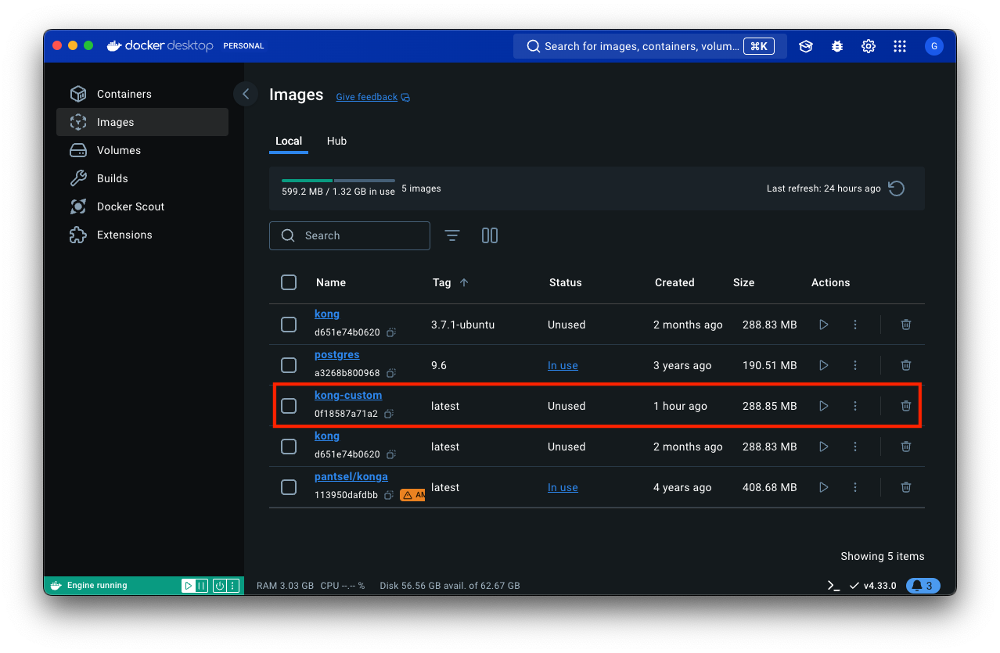

## Docker 실행

빌드한 이미지에 Kong을 위한 DB 정보, Docker 네트워크 등을 설정하여 실행한다.

```
docker run -d --name kong \
		     --network=kong-net \
		     -e "KONG_DATABASE=postgres" \
		     -e "KONG_PG_HOST=kong-database" \
		     -e "KONG_PG_USER=kong" \
		     -e "KONG_PG_PASSWORD=kong" \
		     -e "KONG_PROXY_ACCESS_LOG=/dev/stdout" \
		     -e "KONG_ADMIN_ACCESS_LOG=/dev/stdout" \
		     -e "KONG_PROXY_ERROR_LOG=/dev/stderr" \
		     -e "KONG_ADMIN_ERROR_LOG=/dev/stderr" \
		     -e "KONG_ADMIN_LISTEN=0.0.0.0:8001, 0.0.0.0:8444 ssl" \
		     -p 8000:8000 \
		     -p 8443:8443 \
		     -p 8002:8002 \
		     -p 127.0.0.1:8001:8001 \
		     -p 127.0.0.1:8444:8444 \
		     kong-custom
```

 실행이 잘됐다면 `kong` 컨테이너가 실행중인 것을 확인할 수 있다.
 
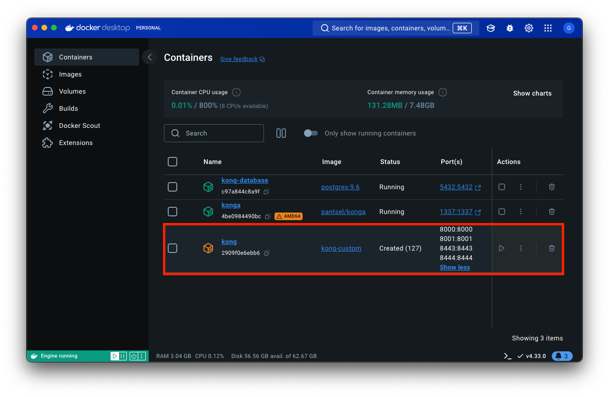

## Kong 실행

Kong 컨테이너 터미널에 접속한다.

```
docker exec -it kong bash
```

Kong을 실행시킨다.

```
kong start
```

# Konga에서 Custom Plugin 적용하기

Kong에서 Plugin 적용 대상은 다음과 같다.

1. Services
2. Routes
3. Consumers
4. Global

본 글에서는 Routes 대상으로 plugin 적용을 해보겠다. 그리고 JWT 인증을 해주는 JWT Custom plugin을 적용해 보겠다.

먼저 konga에 접속하기 위해 `localhost:1337`로 이동해서 대상 route를 클릭한다.

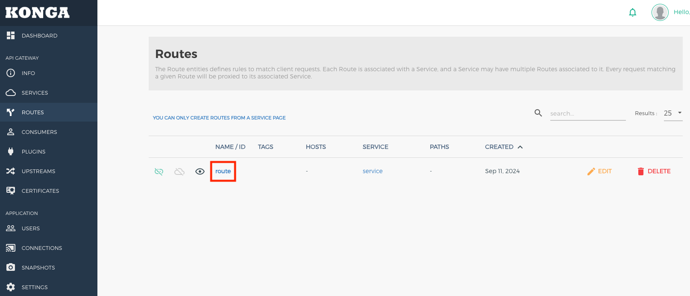

plugin 탭으로 이동해서 add plugin을 클릭한다.

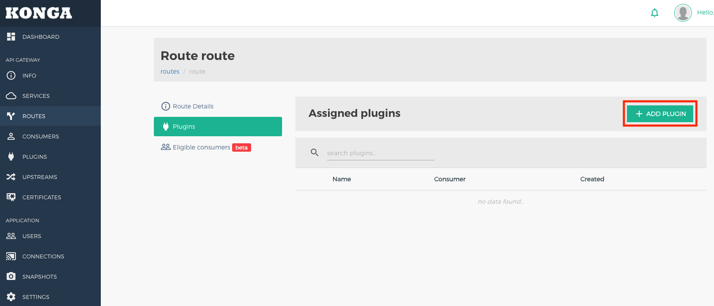

Other 탭으로 이동해 해당 plugin을 추가한다.

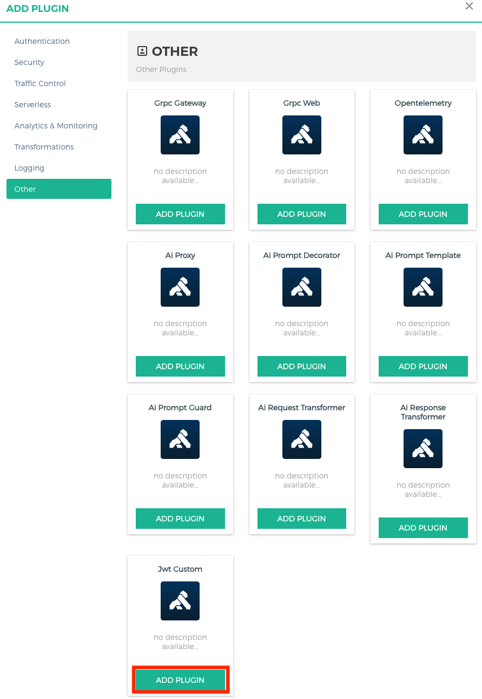

Plugin에 대한 속성 값을 설정한다.

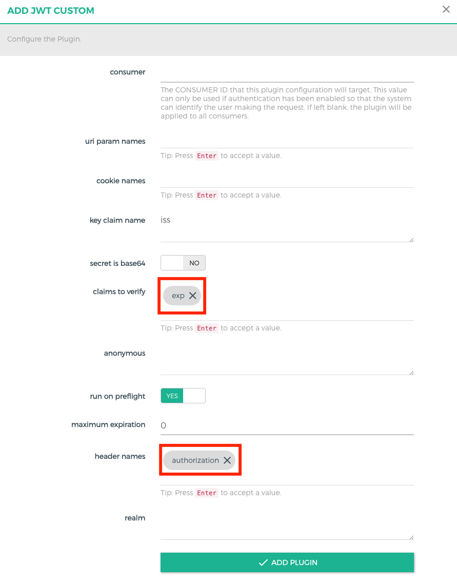

# Kong Manager에서 Custom Plugin 설정

설정이 끝난거 같지만 JWT Custom plugin인 경우 alg와 secret을 변경해 줘야 되는데, 해당 변경사항은 Konga에서 못하고 Kong Manager를 통해서 해야한다. 

Kong Manager는 `localhost:8002`를 통해 접속할 수 있다. 그리고 Consumers 탭으로 이동해서 먼저 Consumer를 새로 만들어 준다.

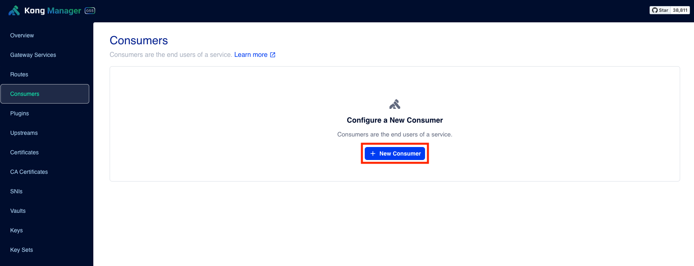

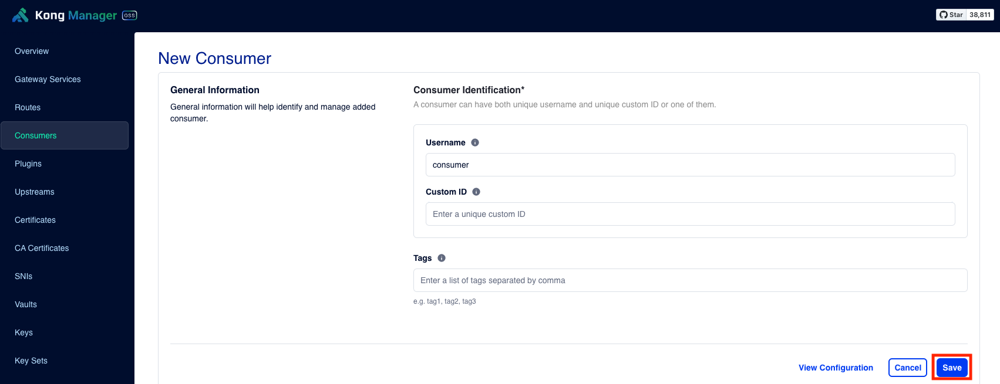

만들어진 consumer를 통해 JWT 관련 설정값을 세팅할 수 있는 기본 JWT plugin을 적용시켜 주자.

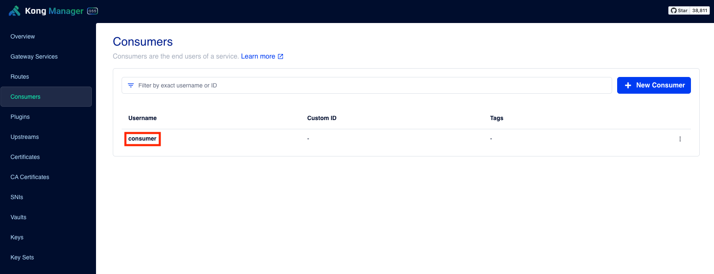

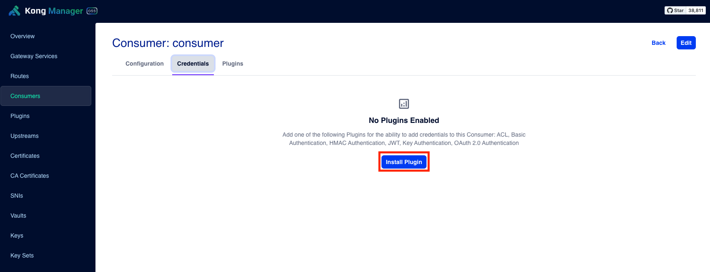

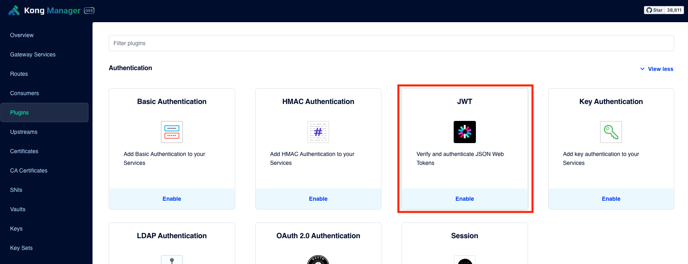

우리의 목적은 custom JWT를 사용하는거고 기본 JWT는 DB에 해당 값을 설정해주는데만 활용한다. 그렇기에 기본 JWT plugin은 disable하자.

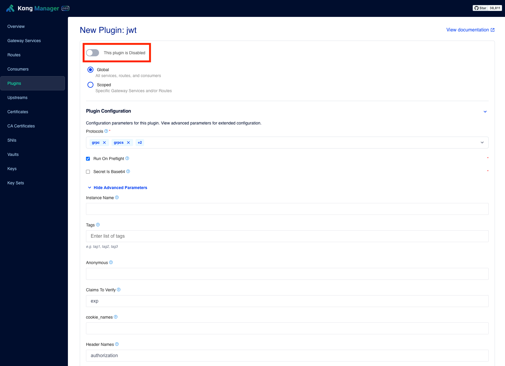

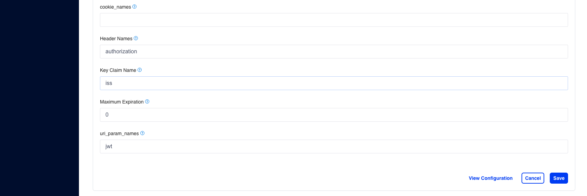

설정이 완료됐으면 다시 consumer에 대한 credentials로 JWT를 설정할 수 있게 된다.

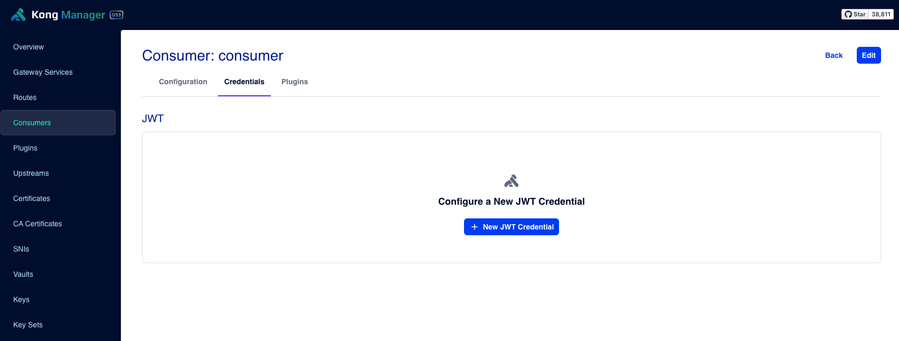

이제 secret key, issuer, algorithm 값을 설정해주자.

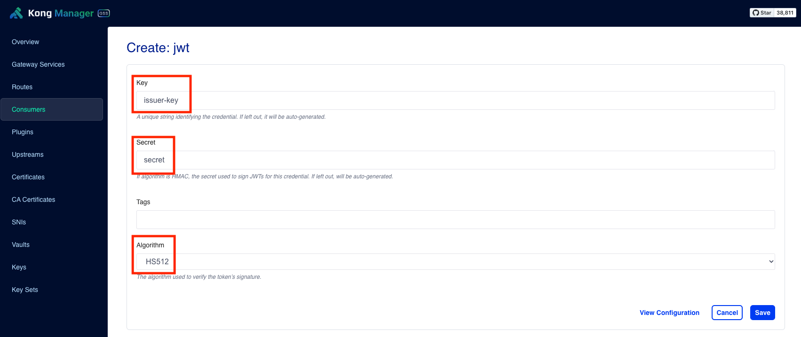

이것으로 Custom plugin 적용 완료!


# 참조

- [https://docs.konghq.com/gateway/latest/plugin-development/distribution/](https://docs.konghq.com/gateway/latest/plugin-development/distribution/)