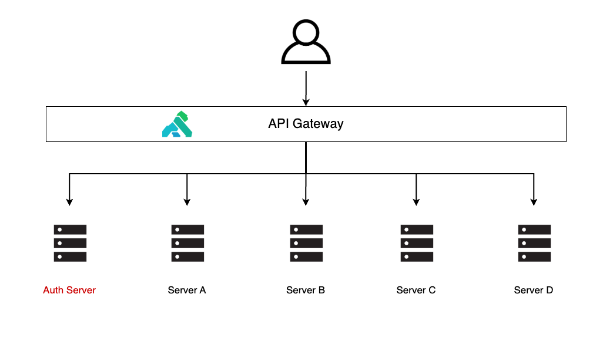
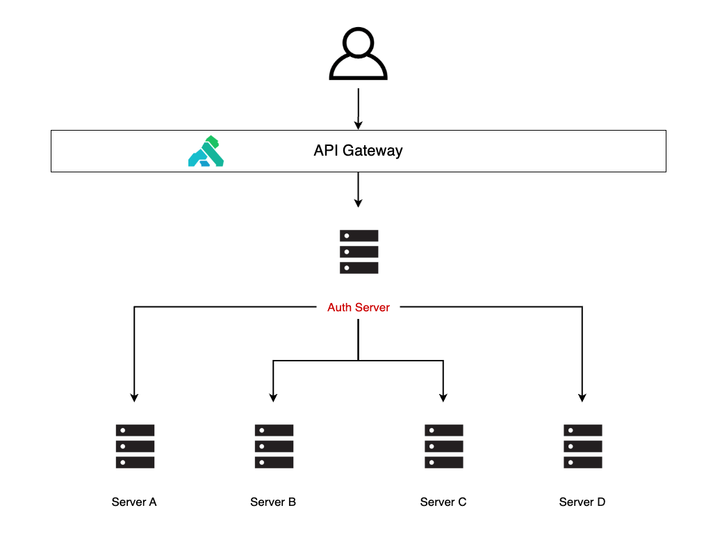
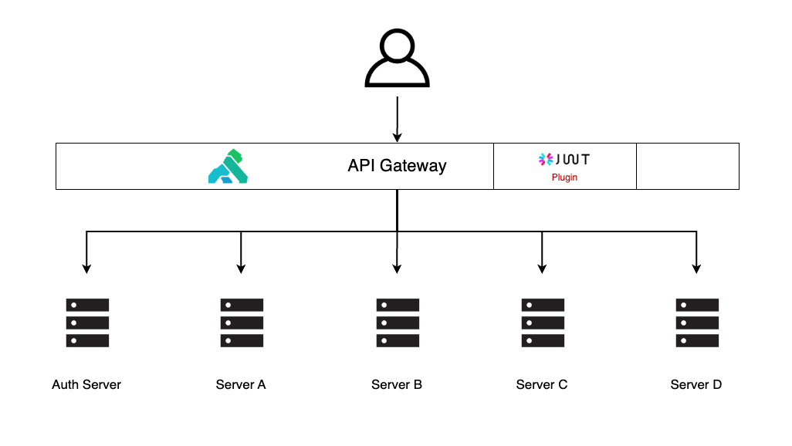

# 배경

백엔드 서버 A, 백엔드 서버 B 등 여러 Spring Boot 서버들이 있다. 이 중 Auth 서버만 회원에 대한 토큰을 주는 회원가입, 로그인 등에 처리를 한다. 나머지 서버들은 토큰을 가지고 Token Filter를 통해 인증과 인가를 한다. 그리고 모든 요청은 API Gateway를 거쳐 서버에 전달된다.

이 상황에서 요구사항은 **"토큰에 대한 인증을 통합하자"** 이다.

# 해결 방법 선택지 🧐

## 방법 1️⃣

### 모든 요청을 Auth 서버를 거치게 하자

- 모든 요청을 Auth 서버를 거치게해서 회원 인증에 대한 로직을 Auth 서버에 위임한다.
- 나머지 서버들은 Auth 서버에서 인증 절차를 거친 회원 정보로 서비스 로직을 수행한다.

## 방법 2️⃣

### 토큰 인증을 API Gateway에서 하자

- API Gateway가 이미 구축되어 있으니 토큰 검증 로직만 추가하자.
- 나머지 서버들이 인증 절차를 건너뛸 수 있게 회원 정보를 요청과 함께 전달한다.

# 선택 방법 💡

두 선택지 중 **"API Gateway에서 인증"** 하는걸 선택하게 됐다.

- Auth 서버에 모든 토큰에 대한 인증을 맡기게 되면 Auth 서버에 대한 트래픽 부담이 몇배로 늘어나게 된다.
- API Gateway가 구축되어 있기 때문에 이를 잘 활용해야 한다.

Kong API Gateway에서는 친절하게 JWT Plugin을 무료로 제공하고 있다.

## 여기서 문제 🤦🏻‍♂️

Kong에서 무료로 제공하는 Plugin은 응답을 수정할 수 없으며, 토큰 인증에 실패한 경우 401을 던진다. 이미 서비스 중인 서버들일 경우 API에 따라 비회원도 응답값을 받을 수 있게 작동해야 되지만 이러한 동작에 한계가 있다. 그래서 아래와 같은 상황이 발생할 수 있다.

## 해결책 📖

하지만 Kong은 그냥 콩이 아니다. 검은콩 그 자체다.

내가 원하는 plugin을 lua script로 개발해서 Gateway에 추가할 수 있다.

> 참고
> - [Kong API Gateway 설치하기](https://nogamsung.github.io/posts/Kong-API-Gateway-%EC%84%A4%EC%B9%98%ED%95%98%EA%B8%B0/)
> - [Kong API Gateway Custom Plugin 적용](https://nogamsung.github.io/posts/Kong-API-Gateway-Custom-Plugin-%EC%A0%81%EC%9A%A9/)

JWT plugin 자체가 오픈 소스이기 때문에 이를 바탕으로 토큰이 있을 경우만 검증을 수행하고, 없으면 수행하지 않고 라우팅을 진행하게 하면 된다!! 심지어 커스터마이징을 할 경우 응답 값도 내가 원하는 대로 수정하면 된다.

