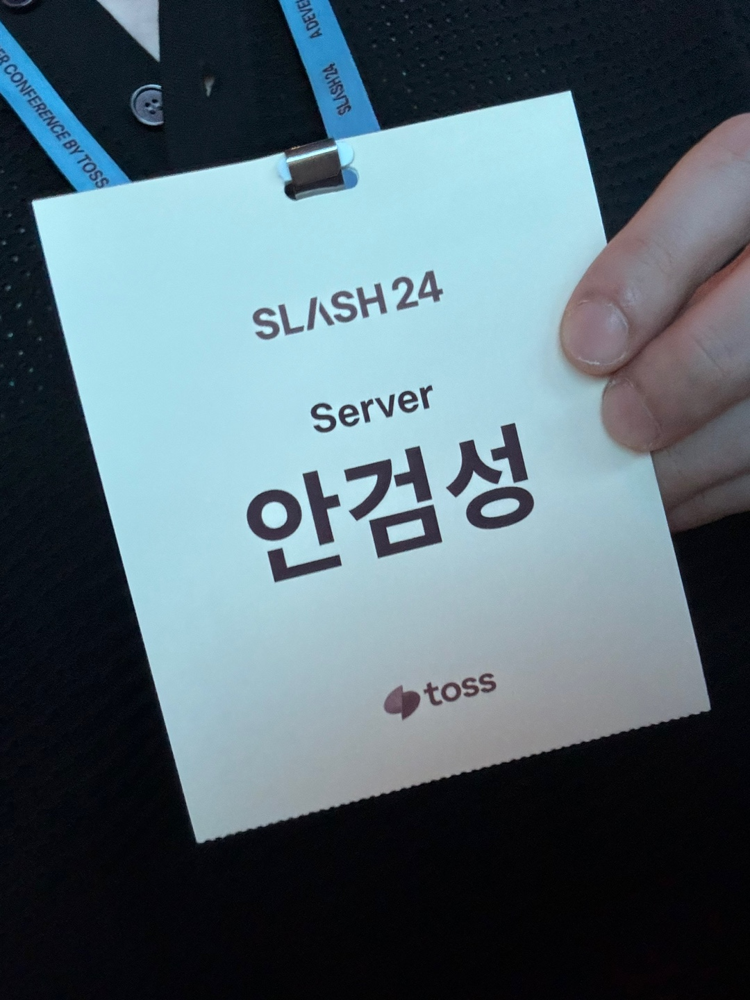
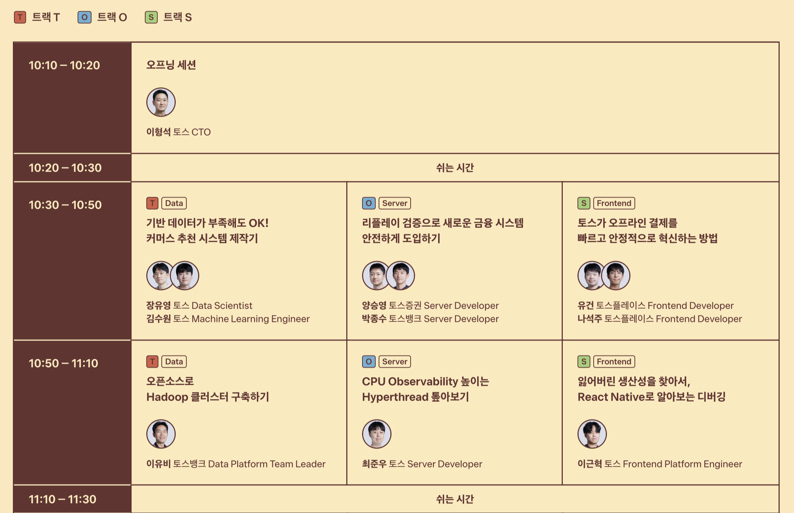
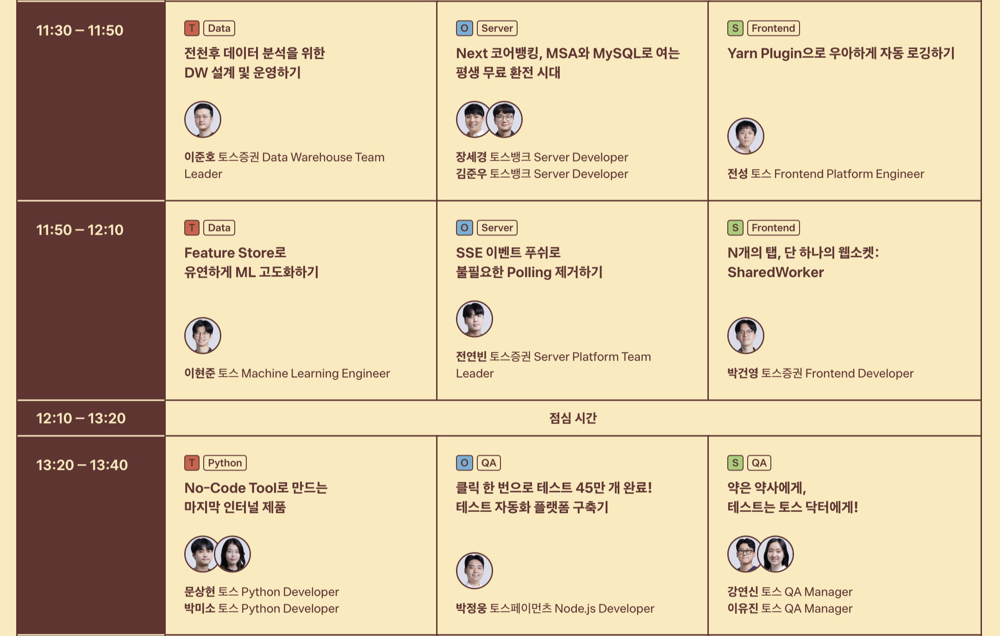
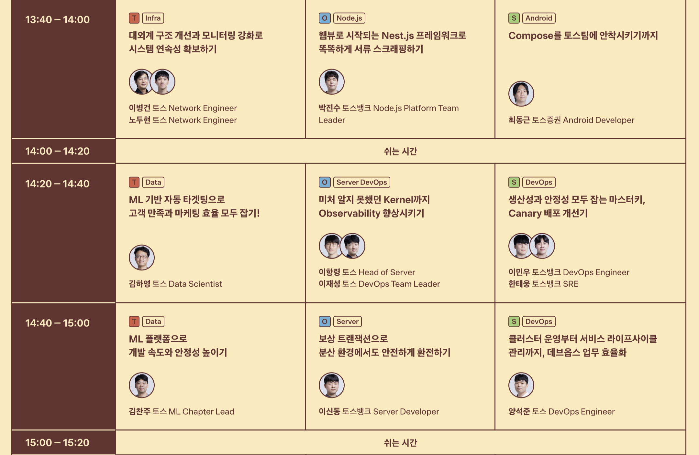
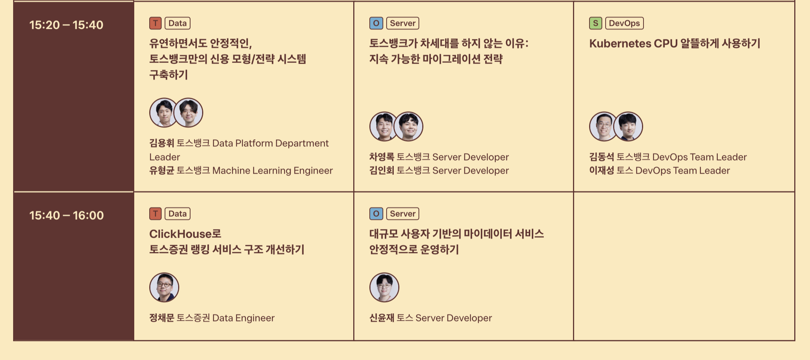
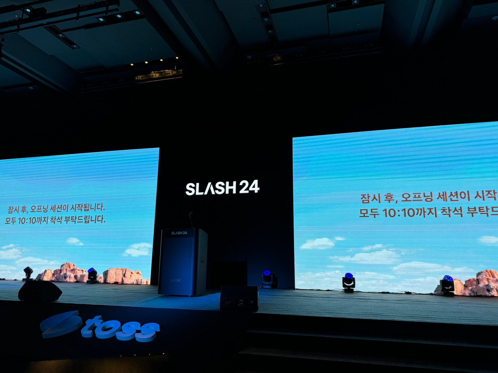
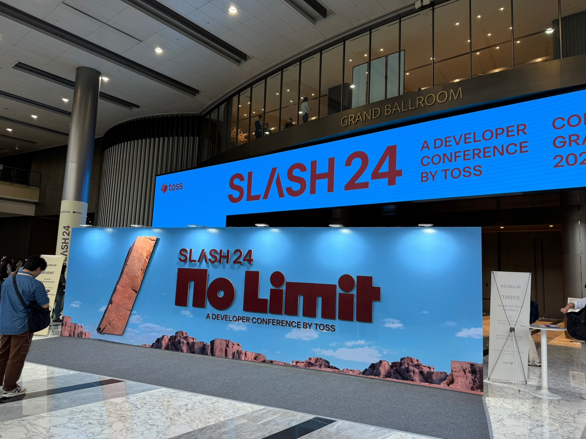

나도 Lucky Biki 하게 토스 컨퍼런스 당첨 됐다!

# 타임테이블 🕐

나는 서버 개발자임으로 당연히 서버 파트 발표에 구독 버튼을 씨게 눌렀다.

# 흥미로웠던 주제

서버 파트 발표들을 들으면서 개인적으로 흥미롭다고 느끼는 주제들과 느낀점을 나열해보겠다.

## 1️⃣ 리플레이 검증으로 새로운 금융 시스템 안전하게 도입하기

##### by 양승영님, 박종수님

거대한 C언어 기반의 Monolithic 원장을 Kotlin 기반 MSA 원장으로 전환하는 과정에 대한 발표였다. 마이그레이션 작업이기 때문에 API 스펙, DB 스키마, 주요 비지니스 로직은 유지되어야 하는게 핵심이다.

마이그레이션을 조금 수월하게 할 수 있는 방법은 없을까 고민하다가 **테스트와 검증 및 확인**을 자동화하셨다. 그리고 자동화의 핵심은 **Read Verifier**와 **Write Verifier**였다.

### Read Verifier

1. 요청이 들어오면 Gateway를 통해 기존의 C언어 기반 Monolithic 서버로 응답한다.
2. 기존 C언어 기반 Monolithic 서버 응답이 오게 되면 Gateway단에서 kafka를 통해 verfier에게 해당 요청과 응답을 보낸다.
3. Verifier는 Kotlin 기반 MSA 서버로 동일한 요청을 보내고 Verifier에게 응답을 보낸다.
4. 마지막으로 Verifier는 동일한 응답을 하는지 확인하고 기록한다.

### Write Verifier

1. 요청이 들어오면 Gateway가 받는데 이때 Kotlin 기반 MSA 서버가 요청을 Intercept한다.
2. Kotlin 기반 MSA 서버에서 처리결과와 CUD 쿼리를 조회 쿼리로 변경해 저장한다.
3. Kotlin 기반 MSA 서버에서 트랜잭션을 롤백하고 Gateway로 응답을 보낸다.
4. 그럼 Gateway가 기존 C 언어 기반 Monolithic 서버로 요청을 보내고 응답을 받는다.
5. Gateway는 클라이언트로 응답을 보내며 Verifier를 통해 검증 요청을 보낸다.
6. Verifier는 Redis로 처리결과와 조회 쿼리를 가져와 실제로 DB에 반영된 데이터와 비교한다.

사실 DB 자체를 두개로 운영해 두 DB에 대한 데이터를 비교하는 방법도 있지만 데이터를 저장하고 유지하는데 가격 부담이 있다고 한다. 그리고 Write Verifier는 동기식으로 동작하기 때문에 실서비스에 영향을 주기 때문에 개발 환경에서만 진행했다고 한다.

> 쿼리 수집은 [P6Spy](https://github.com/p6spy/p6spy)로 하고 CUD 쿼리를 분석해 조회 쿼리로 변환하는건 [ANTLR](https://github.com/antlr/antlr4)를 활용했다고 한다.

### 검증에 도움을 주는 방법

정확한 검증을 위해 어드민 기능을 지원해 검증 수행 이력에 대해 확인하고 엣지 케이스를 발견하기 위해 주기적으로 리포팅 봇을 만들었다고 한다.

## 2️⃣ Next 코어뱅킹, MSA와 MySQL로 여는 평생 무료 환전 시대

##### by 장세경님, 김준우님

다른 은행들과 같게 토스뱅크도 안정성 추구라는 이유로 Oracle을 사용하고 있었다. 뿐만 아니라 Oracle은 신뢰성과 안정성, 확장성, 성능, 오랜기간 축적된 노하우라는 장점들을 가지고 있다. 하지만 Oracle은 단일 장애 지점이 존재하고 비용자체가 비싸다.  그리고 scale out이 제한적이다.

그래서 토스뱅크는 Oracle을 대체하기 위해 Redis 분삭락, Kafka를 활용한 SAGA 패턴 같은 Application Layer 기술을 도입해 트랜잭션을 효율적으로 관리하기로 한다.

마침 외화 서비스를 기획하게 되며 Oracle이 아닌 MySQL로 구축해 보기로 결정한다. 여기서 핵심은 **트랜잭션 아키텍처**다. 환율 거래 금원 흐름을 예시로 드는데 이때 아래의 서버들을 거치게 된다.

### 환전 요청 처리 서버

- 외환 서버
- 수신 원화예금 서버
- 수신 외화예금 서버
- 손익 처리 서버
- 회계 처리 서버

### 환전 요청 트랜잭션

1. 고객이 환전 외환 서버로 환전 요청을 보낸다.
2. 수신 원화 예금 서버로 원화 출금 요청을 보내고 외환 서버가 응답을 받는다.
3. 외환 서버가 다시 수신 외화예금 서버로 외화 입금 요청을 보내고 응답을 외환 서버로 보낸다.
4. 외환 서버는 고객이 보낸 요청에 대해 응답한다.
5. 이후에 거치는 서버들은 내부적인 회계 처리를 위한 동작이기 때문에 kafka를 이용해 비동기 처리를 한다.

만약 기존과 같은 방식으로 환전을 처리 했다면 이 모든게 하나의 트랜잭션으로 묶여 환전 처리가 매우 느렸을 것이다.

## 3️⃣ 보상 트랜잭션으로 분산 환경에서도 안전하게 환전하기

##### by 이신동님

이 발표도 환전 서비스에 대한 내용이다. 발표에 핵심은 **보상 트랜잭션**이다.

### 2PC vs SAGA 분산 트랜잭션

#### Two Phase Commit (2PC)

1. Coordinator가 2개 이상의 서버들에게 Commit 가능 여부 질의, 즉 Voting을 하고 서버들은 Coordinator에게 가능 여부 응답을 한다.
2. 서버들의 응답이 ack, 즉 Commit을 허용한다고 하면 Commit을 진행한다.

#### Saga Pattern

- 각 서비스의 작은 트랜잭션들을 실행하면서 진행한다.
- 특정 단계에서 실패하면 보상 트랜잭션을 실행한다.

|     | 2 Phase Commit       | Saga                          |
| --- | -------------------- | ----------------------------- |
| 장점  | - 강한 일관성             | - 높은 가용성 - 높은 확장성          |
| 단점  | - 낮은 가용성 - 낮은 확장성 | - 중간 상태 노출 - 보상 트랜잭션 구현 필요 |

발표자 분 팀은 Saga Pattern을 선택했다고 한다. 여기서 또 두 개의 Saga 방식이 있다.

- Choreography Saga: Message Broker를 통해 Service들에게 메세지 전달한다.
- Orchestration Saga: Orchestrator 역할을 하는 서버가 나머지 서버들에게 메세지 전달을 하는 Master Node와 Slave Node 방식이다.

Orchestration을 해줄 수 있는 환전 서버가 있기 때문에 Orchestration Saga를 선택했다고 한다. 즉 Orchestrator 서버인 환전 서버는 원화 계좌와 외화 계좌 서버들과 통신을 하는 형태가 된다.

### SAGA를 이용한 환전 구현

1. 환전 요청이 오면 환전 서버가 원화 계좌 서버로 출금 요청을 보낸다.
2. 환전 서버가 출금을 성공적으로 됐다는 응답을 받으면 외화 계좌로 입금 요청을 보낸다.

### 보상 트랜잭션

환전 과정에서 정상이든 비정상이든 입출금 실패에 대한 동작을 수행하게 해야한다. 이때 보상 트랜잭션을 이용한다. 

입출금 실패는 다음과 같은 이유로 발생할 수 있다.

| 정상적인 실패                                            | 비정상적인 실패 (에러)                                                  |
| -------------------------------------------------- | -------------------------------------------------------------- |
| - 잔액 부족 - 잔액 증명서 출력 - 계좌 해지 - 고객/계좌 거래 제한 | - 서버 에러 (5XX 응답/타임아웃) - 네트워크 에러 - 메세지 produce/consume 실패 |

보상 트랜잭션은 다음과 같은 상황일때 이루어 진다.

1. 환전 서버에서 원화 계좌 서버로 출금 요청을 보내 환전 서버는 성공 응답을 받는다.
2. 외화 계좌로 입금 요청을 보냈지만 실패하게 된다.
3. 이때 원화 계좌 서버로 보상 트랜잭션 즉 1번 스탭에서 발생한 출금 금액을 다시 입금 처리 해준다.

1, 2번은 HTTP 통신을 통해 동기적으로 처리를 하지만 클라이언트에게 빠른 실패 응답을 보내기 위해 출금 취소는 Kafka를 활용해 비동기적으로 처리했다고 한다. 그리고 잔액에 대한 정합성만 보장해주면 되기 때문에 Kafka Messaging 방식을 선택했다고 한다.

> 반드시 입금부터 진행하지 않고 출금부터 해야한다. 만약 외화 계좌로 입금이 실패 됐는데, 마침 카드사에서 출금 요청이 들어오면 입금 취소로 인해 외화 계좌가 마이너스가 될 수 있기 때문이다.

## 그외

사실 모든 발표들이 전부 주옥같이 느껴졌지만 내 지식의 한계로 인해 모두 소화해내진 못했다.

이항령님과 이재성님이 발표한 **"미처 알지 못했던 Kernel까지 Observability 향상시키기"** 에선 커널 레벨에서 코드를 분석하며 컴퓨팅 리소스를 효율적으로 활용하기 위해 아주 low 레벨로 들어간 느낌이였는데 매우 인상적이였다. 해당 발표에서 내가 습득한 키워드들은 다음과 같다.

- ebpf가 kernel 분석에 도움을 준다.
- page fault가 시간을 많이 잡아 먹는다.
- numa를 통해 메모리 액세스를 모니터링 할 수 있다.
- iptable이 문제가 되서 ipvs로 변경했다.

그리고 마지막 발표자인 신윤재님의 **"대규모 사용자 기반의 마이데이터 서비스 안정적으로 운영하기"** 에서는 서킷 브레이커에 대한 내용을 다뤘고 내가 습득한 키워드들은 다음과 같다.

- 외부로 나가는 트래픽을 관리하기 위해 Cordinator를 개발했다.
- Resilience라는 서킷 브레이커를 사용했지만 문제가 있었다.
- 서킷 브레이커를 별도의 서버에 구현했다.

# 느낀점 🧐

이전에 컨퍼런스를 갔을 때와 다르게 비교적 많은걸 이해할 수 있었다. 어떻게 보면 그만큼 성장해서 뿌듯하다고 느낄 수도 있을거 같지만,, 현타가 쎄게 왔다. 역시 토스에는 고수 분들이 많았다. 이분들이 겪은 시행착오, 그리고 어디까지 집요하게 파고 들었는지 얘기를 들으며 자아성찰과 반성의 시간이 되었다.

# 현장 사진

# 출처

- SLASH24 - 토스