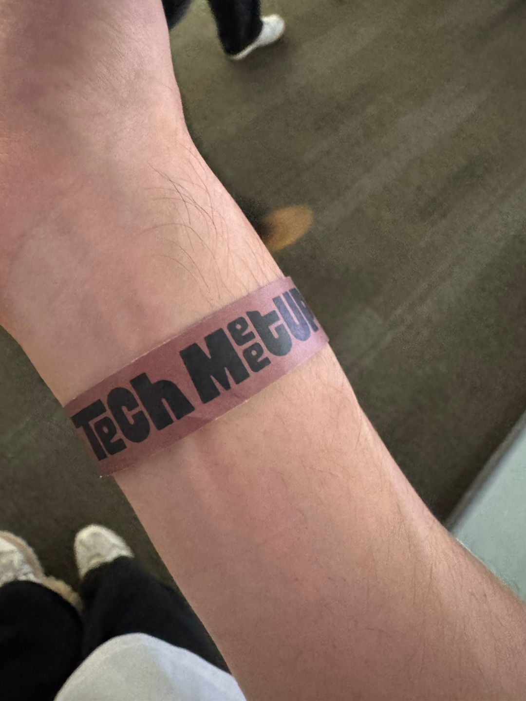
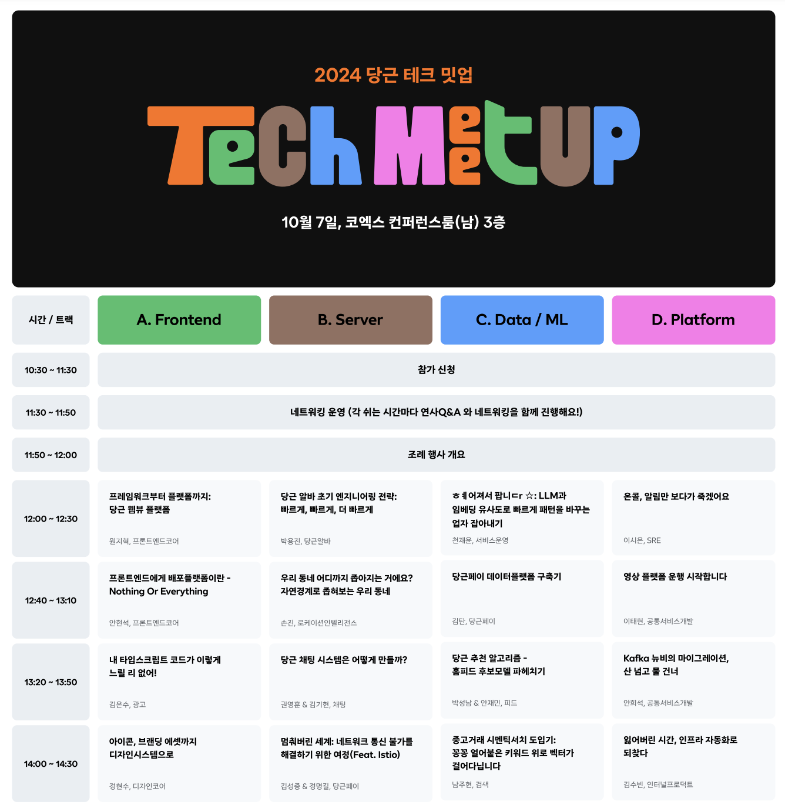
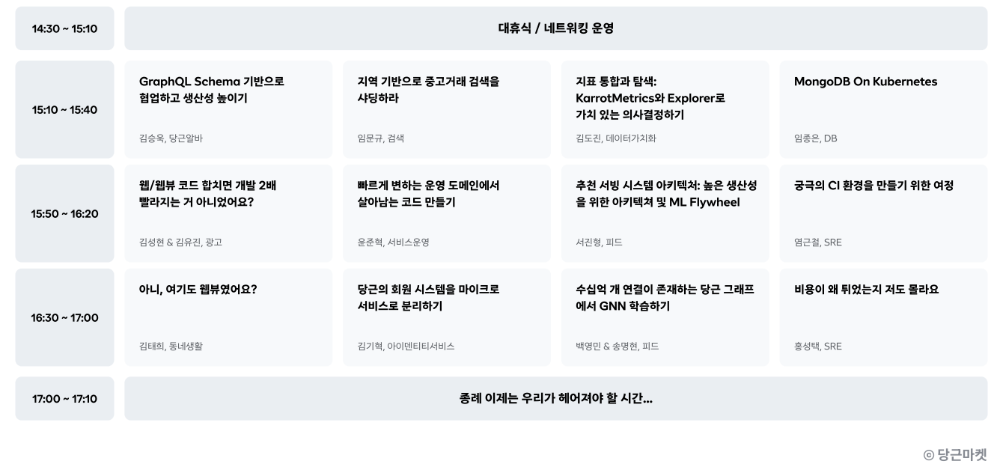
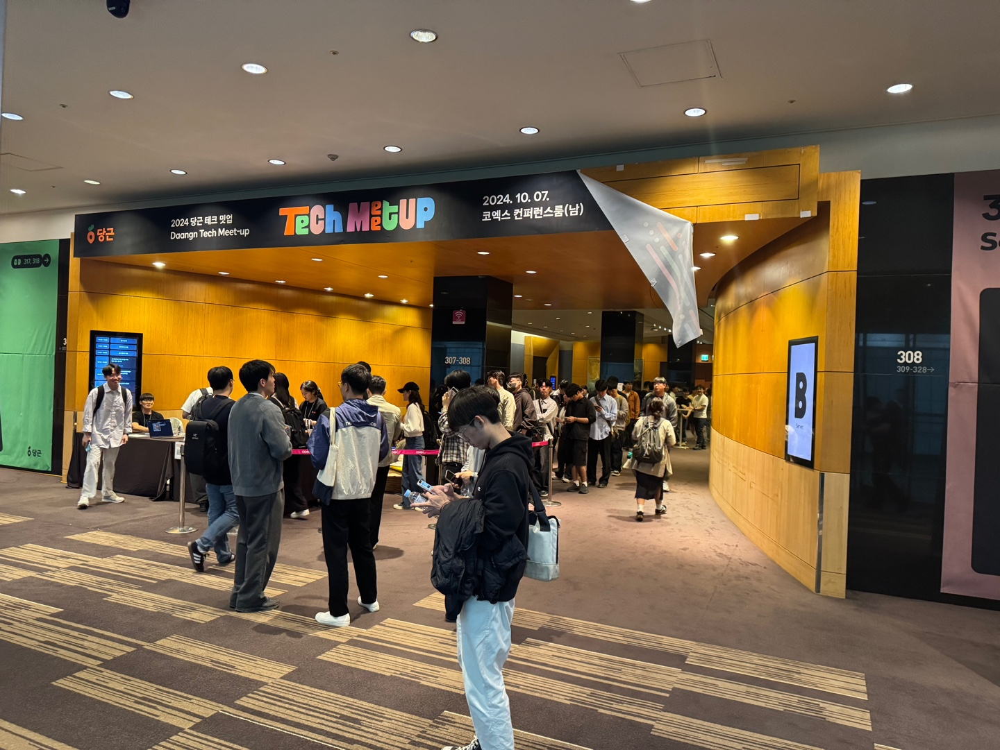
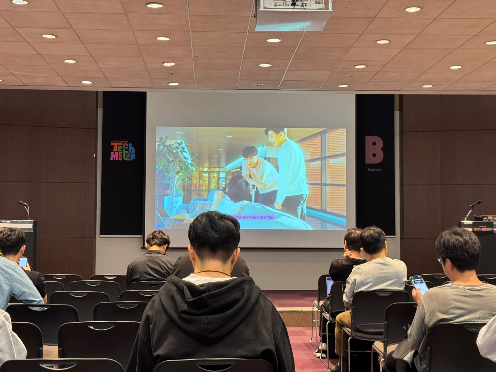
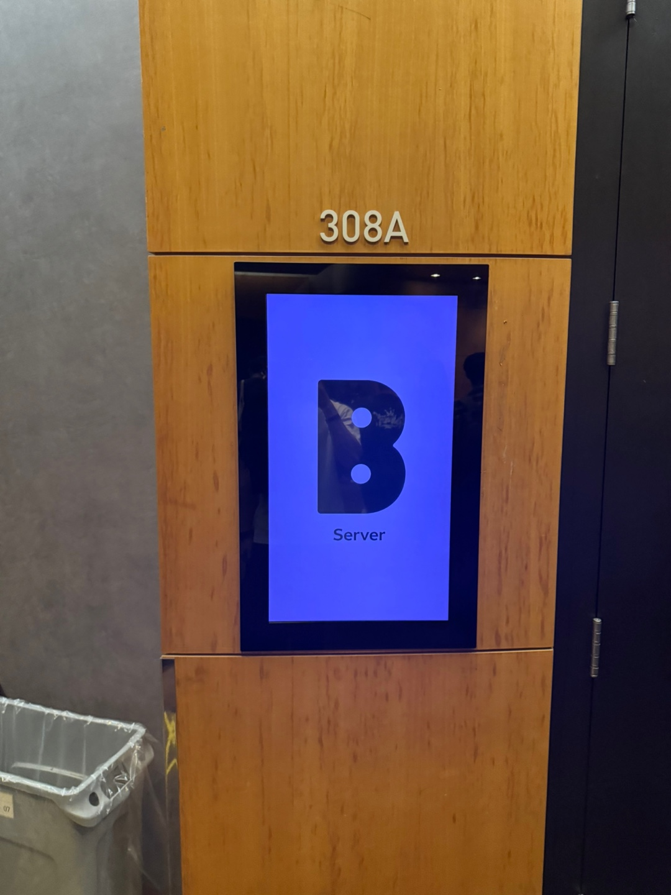

올해 토스 컨퍼런스에 이어 당근 테크 밋업까지 당첨이 되서 다녀오게 됐다! 🕺🏻

발표 세션과 네트워킹 세션이 함께 진행 됐고, 난 두 네트워킹 세션에 참여했다.

# 타임테이블 🕐

# 흥미로웠던 주제

## 1️⃣ 당근 알바 초기 엔지니어링 전략: 빠르게, 빠르게 더 빠르게

##### by 박용진님

초기에 정말 빠르게 제품을 개발하며 동시에 분석을 해야 되서 많은 고민을 했다고 한다.

### 데이터 분석에 드는 비용

데이터 분석에 드는 비용을 아래와 같이 정의했다.

- 데이터 분석을 위한 엔지니어링 비용
- 데이터 분석 활동에 드는 비용

데이터 분석은 기존 데이터를 추출하고, 분석을 위한 데이터를 만드는 번거로움이 있다. 그래서 데이터를 따로 추출하지 않고 이벤트 기반 분석 서비스를 만들었다고 한다. 이벤트 기반 분석 서비스를 활용하면 다음과 같은 장점이 있다.

- 데이터 분석을 위한 별도 저장 공간이 필요 없음
- 원하는 시점에 API를 호출함으로써 간편하게 데이터를 저장
- SQL이 아닌 웹에서 직관적으로 데이터 조합

### 데이터 분석으로부터 얻는 생산성

데이터 분석을 통해 아래와 같은 생산성을 얻었다고 한다.

- 사용자 피드백을 빠르게 확인 하여 가설과 실험에 대한 의사결정 비용 감소
- 데이터 분석 결과를 통해 사용자에 대한 이해를 바탕으로 팀 구성원 간 효율적인 의사소통

그리고 여기서 팁은 데이터 분석 요청자와 수행자 역할을 두명이 아닌 한명의 역할로 해서 데이터 분석에 필요한 불필요한 의사소통 비용을 없앴다고 한다.

## 2️⃣ 당근 채팅 시스템은 어떻게 만들까?

##### by 권영훈님, 김기현님

당근의 채팅 시스템은 크게 3가지 컴포넌트로 구성되어 있다.

- 챗 서버
- 푸쉬 서버
- 데이터베이스 서버

### 1:1 채팅

서버가 한대만 있을 땐 프로세스가 다음과 같다.

1. 유저가 채팅 서버 접속
2. 채팅 서버에 User ID와 User Session ID를 키 벨류 페이로 저장
3. 유저가 채팅 서버로 메세지 전송
4. UserID로 User Session ID를 조회해서 다른 유저한테 메세지 전달

하지만 서버가 두대 이상이라면 유저가 접속한 서버가 다를 수 있기 때문에 서버 로컬 메모리에 사용자 세션 ID가 없을 수 있다. 이를 해결하는 방법은 두 가지가 있다.

- 공유 메모리 사용. 유저가 접속한 서버 IP 저장
- 유저 아이디 기반 Pub/Sub

이번엔 서버가 10대 이상으로 늘어나면 서버간 그물망 연결이 형성돼 복잡도가 증가하고 확장에도 불리해진다. 그래서 이를 해결하기 위해 메세지 Queue를 활용한다고 한다. 메세지가 전달되면 Queue에 넣어지게 되고 Consumer가 메세지를 전달하게 되는 메세지 릴레이 요청이 만들어진다. 그리고 비동기로 메세지 릴레이 요청을 수행한다고 한다.

### 푸쉬 알림

#### 미접속 유저

Key-Value를 봤을때 값이 없으면 푸쉬 서버로 메세지 요청을 보낸다.

#### 잘못된 데이터 - 서버에 유저 세션이 존재하지 않을 때

Key-Value가 틀린 경우 Key-Value 스토리지에서 데이터를 삭제하고 푸쉬 서버한테 요청을 보낸다고 한다.

### 그룹 채팅

그룹 채팅인 경우 기존 시스템을 그대로 유지하게 되면 1000명의 유저가 있는 그룹 채팅인 경우 Consumer에서 1000개의 요청을 Server에 보낸다고 한다. 그래서 유저ID를 묶어서 보낸다. 근데 Timeout 같은 문제가 발생할 수 있으니 Chunk 단위로 나눠서 수행하게 개발했다.

## 4️⃣ 멈춰버린 세계: 네트워크 통신 불가를 해결하기 위한 여정(Feat. Istio)

##### by 김성종님, 정명길님

### DB와 Redis 커넥션을 잃다

트레픽이 증가하면서 DB와 Redis에 Connection이 끊기는 현상이 일어났다고 한다.

#### 추정 원인

- 애플리케이션 Thread 고갈
- JVM GC Pause Time 증가
- Redis, Database 장애
- AWS Maintenance
- Core DNS 장애

#### 해결 방법

1. Internal Service Segregation
2. Event Streaming Pattern
3. ZGC 적용
4. SQL Query Optimization
5. API Performance Optimization
6. Connection, Read Timeout 조정

이러한 과정을 통해 CPU Usage, Query Time 등 다양한 수치를 안정화 시켰다. 하지만 문제가 계속해서 발생 됐다. 그래도 이번에 분석을 해보니 문제 발생 시점이 배포 시점과 일치해서 Istio 문제라고 생각했다고 한다.

#### 추가 해결

확인 해본 결과 Kubernetes 환경에서 CPU Limit을 설정했는데, 이를 제거해보니 Latency와 Throttle이 제거됐다고 한다.

# 네트워킹 세션

다양한 네트워킹 세션이 있었는데, 6명에서 10명정도에 소수 인원으로 진행돼 마감이 정말 빠르게 됐다. 다행히 오프런(?)을 해서 두 세션 정도 참여할 수 있었다.

## 당근페이 머니서비스팀

##### by 윈터님, 윌리엄님

주최자분들 주도하에 다양한 얘기를 나눴다. 세션 참여자 분들도 대부분 핀테크 업계에서 근무를 하고 계셨다.

### 당근페이만 거래해요

기억에 남는건 참여자 한분께서 본인은 당근 페이로만 거래를 하며, 판매 글에도 명시해 둔다고 했다. 당근 페이를 이용하지 않으면 거래를 할 때 계좌번호도 물어봐야 되는 번거로운데 당근페이가 이를 간단하게 해결해준다고 했다. 그때 윈터님과 윌리엄님이 표정이 너무 좋아보였다 ㅋㅋㅋ 머니서비스팀에서 의도한대로 서비스가 잘 이용되고 있고 우연하게 이를 칭찬하는 유저의 피드백을 받으니 매우 흡족해 하신거 같았다. 나였어도 너무 행복했을거 같아서 한편으론 부러우면서 다른한편으론 대단하다 생각했다.

### 코틀린 전환

필요에 따라 몇몇 서비스들은 코틀린으로 전환을 했다고 해서 팀원들을 어떻게 설득했는지 궁금해서 물어봤다. 머니서비스팀에서는 새로운 기술에 대해 매우 오픈되어 있으며 누군가 주도적으로 리드를 하면 다른 팀원들이 잘 따라와주는 문화라고 설명해주셨다.

## 당근페이 어카운트 서비스팀

##### by 우즈님

### 어카운트 마스터

우즈님은 어카운트 마스터라고 할 수 있는 커리어를 가지고 있으셨다. 나 또한 어카운트 서비스를 현재 회사에서 다루고 있어서 이전 그리고 현재 맞닥드리고 있는 문제들에 대해 끊임 없이 여쭤봤다. 이런 커리어를 가지고 있는 분을 접할 수 있는게 흔치 않아서 정말 많은 질문들을 했고 다음과 같은 얘기를 주고 받았다.

- JWT 토큰들은 어떻게 관리되고 있는지
- 핀테크 특성상 JWT 외 사용자 요청을 처리할때 별도에 추가 인증이 있는지

15분 넘게 얘기를 나눈거 같은데 고민도 깊이 해주시면서 친절하게 얘기해주셔서 정말 감사했다. 🥹 그리고 내 질문과 관련해서 추후에 찾아볼만한 키워드들도 제시해 주셨다.

- TLS Token Binding
- HMAC Key

# 현장 사진

# 출처

- 당근 테크 밋업 2024