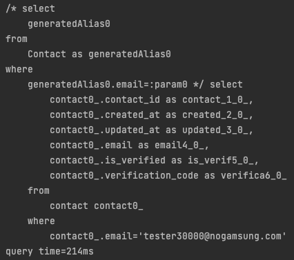
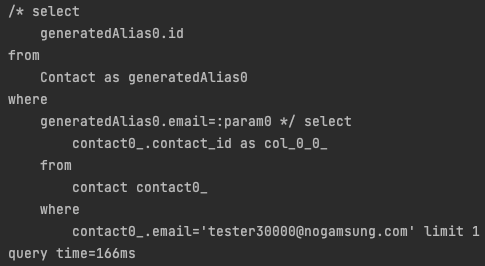

> 대부분의 서비스에서는 아이디 또는 이메일 중복을 검증합니다.
> 그래서 이번에 중복 검증을 위한 query 개선을 해봤습니다.

## 목차
1. [설명](#1)
2. [findBy](#2)
3. [countBy](#3)
4. [existBy](#4)
5. [정리](#5)
---
## <a id="1">설명</a>
Email을 가지고 있는 `Contact`라는 entity에서 이메일 중복 검사를 수행하기 위해 query를 하는 상황입니다. 테스트를 위해 50,000개의 데이터
`tester1@nogamsung.com` 부터 `tester50000@nogamsung.com`를 먼저 주입하여 진행하였습니다.
##### Domain
```java
@Getter
@Entity
@NoArgsConstructor(access = AccessLevel.PROTECTED)
public class Contact extends BaseEntity {
    // ..
    @Column(nullable = false, unique = true)
    private String email;
    // ...
}
```
### <a id="2">`findBy`</a>
##### Repository
```java
public interface ContactRepsitory extends JpaRepository<Contact, Long> {
    Optional<Contact> findByEmail(String email);
}
```
##### Test
```java
@Test
void findByEmail() {
    // given
    String email = "tester30000@nogamsung.com";

    // when
    Optional<Contact> result = contactRepository.findByEmail(email);

    // then
    assertThat(result).isPresent();
}
```

**결과: 0.214초**
### <a id="3">`countBy`</a>
#### Repository
```java
public interface ContactRepsitory extends JpaRepository<Contact, Long> {
    int countByEmail(String email);
}
```
##### Test
```java
@Test
void countByEmail() {
    // given
    String email = "tester30000@nogamsung.com";

    // when
    int result = contactRepository.countByEmail(email);

    // then
    assertThat(result).isEqualTo(1);
}
```

**결과: 0.196초**
### <a id="4">`existsBy`</a>
#### Repository
```java
public interface ContactRepsitory extends JpaRepository<Contact, Long> {
    boolean existsByEmail(String email);
}
```
##### Test
```java
@Test
void existsByEmail() {
    // given
    String email = "tester30000@nogamsung.com";

    // when
    boolean result = contactRepository.existsByEmail(email);

    // then
    assertThat(result).isTrue();
}
```

**결과: 0.166초**

## <a id="5">정리</a>
|     | findBy | countBy | existsBy |
|-----|--------|---------|----------|
| 시간  | 0.214초 | 0.196초  | 0.166초   |

부끄럽게도 이전에는 `findBy`를 중복 여부 확인을 위한 로직에서 자연스럽게 이 방법으로 썼습니다. 하지만 `findBy`을 쓸 경우 `Contact`에 있는 모든 데이터를 
DB로부터 가져오게 됩니다. 즉, 네트워크에 더 많은 데이터가 전송될 것이고, WAS에 메모리를 더 많이 낭비하게 됩니다.

그다음 `countBy`는 `email`에 index를 부여하였음에도 불구하고 여러 필드들을 검색하게 됩니다. 예시에 domain처럼 index 적용하였을 때 한 개 이상의 데이터가
존재할 수 없기에 index의 개념을 적극적으로 활용하지 못하게됩니다.

마지막으로 `existBy`를 사용하게 되면 Jpa에서 limit 1을 자동으로 넣어서 query문을 날리기 때문에 가장 효율적이고 정확하게 중복 여부를 데이터만 응답받기에
**가장 효율적인 방법**입니다.
